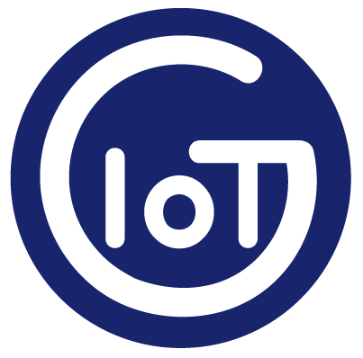
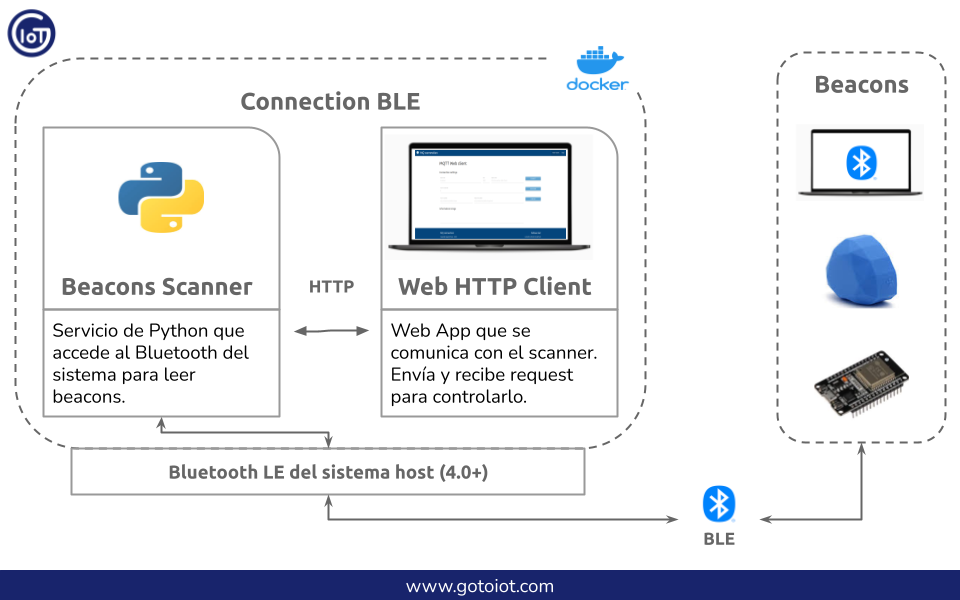

<a href="https://www.gotoiot.com/">
    
</a>

Connection BLE
==============

*Ayudaría mucho si apoyaras este proyecto con una ⭐ en Github!*

Este proyecto es un ecosistema que posee aplicaciones y servicios que trabajan en conjunto para formar una plataforma integral BLE. 

Está formado por un servicio que escanea distintas tramas de beacons y posee una API REST HTTP como interfaz, y por un cliente web HTTP que sirve para comunicarse con el scanner. Los servicios corren sobre el ecosistema Docker que te permiten ejecutarlos de igual manera en diferentes plataformas. Así mismo es posible conectarse a la plataforma a través de dispositivos externos con BLE, como pueden ser beacons, sistemas embebidos y otros sistemas.

Para que tengas una idea clara, en esta imagen hay un diagrama de como interactuan las partes entre sí.



> Para que esta aplicación funcione deberías contar con un host que tenga Bluetooth LE 4.0+.

## Comenzando 🚀

Esta sección es una guía con los pasos escenciales para que puedas poner en marcha la aplicación.

<details><summary><b>Mira los pasos necesarios</b></summary>

### Instalar las dependencias

Para correr este proyecto es necesario que instales `Docker` y `Docker Compose`. 

En [este artículo](https://www.gotoiot.com/pages/articles/docker_installation_linux/) publicado en nuestra web están los detalles para instalar Docker y Docker Compose en una máquina Linux. Si querés instalar ambas herramientas en una Raspberry Pi podés seguir [este artículo](https://www.gotoiot.com/pages/articles/rpi_docker_installation) de nuestra web que te muestra todos los pasos necesarios.

En caso que quieras instalar las herramientas en otra plataforma o tengas algún incoveniente, podes leer la documentación oficial de [Docker](https://docs.docker.com/get-docker/) y también la de [Docker Compose](https://docs.docker.com/compose/install/).

Continua con la descarga del código cuando tengas las dependencias instaladas y funcionando.

### Descargar el código

Para descargar el codigo, lo más conveniente es realizar un `fork` de este proyecto a tu cuenta personal haciendo click en [este link](https://github.com/gotoiot/connection-ble/fork). Una vez que ya tengas el fork a tu cuenta, descargalo desde la terminal con este comando (acordate de poner tu usuario en el link):

```
git clone https://github.com/USER/connection-ble.git
```

Cuando tengas el código principal, descargá/actualizá los submódulos del proyecto con este comando y continua con la ejecución de la aplicación una vez que descarguen:

```
git submodule update --init --recursive --remote
```

> En caso que no tengas una cuenta en Github podes clonar directamente este repo y descargar los submódulos.

### Ejecutar la aplicación

Lo primero que tenés que hacer para correr la aplicación es compilar los servicios necesarios. Abrí una terminal en la raíz del proyecto y ejecutá este comando para compilar (esta acción puede demorar unos minutos dependiendo tu conexión a internet):

```
docker-compose build beacons-scanner
```

Una vez compilado tenés que correr el comando `docker-compose up`, que va a descargar la imágen de Docker para el cliente HTTP y luego poner en funcionamiento los servicios. Para acceder al cliente web ingresa a esta URL [http://localhost:5001/](http://localhost:5001/) en el navegador (cambia la IP de la URL si la estás corriendo de manera remota). 

Si pudiste acceder al cliente web significa que la aplicación se encuentra corriendo bien. 

</details>

Continuá explorando el proyecto una vez que lo tengas funcionando.


## Información principal 🔍

En esta sección vas a encontrar la información para entender y configurar el proyecto.

<details><summary><b>Mira los detalles</b></summary>

### Cofiguración del Web HTTP Client

El cliente web HTTP permite ejecutar requests para obtener y enviar datos desde el scanner de beacons. Si bien en este proyecto sirve para comunicarse con el scanner de beacons, es un cliente HTTP genérico que se puede comunicar con otros servicios. Más abajo, en el apartado "Comunicación entre Connection BLE y beacons" vas a encontrar todos los detalles para poder enviar los request al scanner para configurarlo y obtener la información de los beacons leídos.

Si querés saber más detalles sobre el cliente HTTP podes ir al [README del proyecto](https://github.com/gotoiot/web-http-client).

### Configuración del Scanner de Beacons

A grandes rasgos, el servicio de scanner de beacons toma las configuraciones que se encuentran en el archivo `service-beacons-scanner/_storage/settings.json` y comienza a funcionar. Así mismo, en la configuración por defecto comienza a enviar lecturas simuladas de beacons para que puedas usar la aplicación sin necesidad de contar con beacons reales. Por esa razón, si contas con beacons reales vas a necesitar poner en flag `FAKE_SCAN` en `false`.

Más allá de estos resumidos detalles, en el [README del proyecto](https://github.com/gotoiot/service-beacons-scanner) vas a encontrar toda la información relevante del servicio, por lo que es conveniente que lo leas para tener un mejor contexto de cómo funciona. En la [sección de configuración](https://github.com/gotoiot/service-beacons-scanner#configuraci%C3%B3n-de-la-aplicaci%C3%B3n) vas a encontrar detalles sobre qué significa cada una de las variables de configuración del sistema, y en la sección [interfaz HTTP](https://github.com/gotoiot/service-beacons-scanner#interfaz-http) vas a poder ver todos los recursos HTTP que posee el servicio y con qué métodos y datos acceder a cada endpoint.

Así mismo, el archivo `service-beacons-scanner/test/other/requests.http` contiene todos los requests para acceder al servicio utilizando la extensión REST Client de Visual Studio Code, la cual es una forma muy conveniente de comunicarte.

### Crear beacons BLE basados en "Embed IoT Core"

Dentro de nuestros proyectos tenemos a [Embed IoT Core](https://github.com/gotoiot/embed-iot-core), que es una plataforma exclusivamente dedicada al desarrollo de aplicaciones embebidas orientadas a IoT. En este proyecto hay aplicaciones de ejemplo para distintos protocolos de comunicación; está optimizado para funcionar en una placa `ESP32` o similar y utiliza la herramienta `PlatformIO` para el manejo de bibliotecas, compilación y descarga del código a la placa y muchas cosas más. 

Si contás con una placa y querés poner en marcha una aplicación embebida para conectarte, te recomendamos que le des una mirada al [README del proyecto](https://github.com/gotoiot/embed-iot-core), que tiene toda la información para que entiendas de qué se trata, cómo descargar el código e instalar las dependencias, y cómo poner en marcha un ejemplo de prueba.

Cuando tengas andando el ejemplo de prueba, podés elegir algunas de las aplicaciones BLE dentro de la [lista de aplicaciones](https://github.com/gotoiot/embed-iot-core#lista-de-aplicaciones) para que empiece a transmitir tramas beacons que puedan ser visualizadas en el cliente HTTP utilizando el servicio de scanner de beacons como intermediario.

La info necesaria para configurar y correr las diferentes aplicaciones la vas a encontrar directamente en el README del proyecto, así podés acceder siempre a la información actualizada. 

### Crear beacons BLE con un sistema Linux

Si contas con un sistema Linux que posea BLE y además tenés instalado Docker y Docker Compose en ese sistema, una forma muy conveniente de probar la comunicación es que emitas tramas beacons desde ahí. Ese sistema debe ser otro hardware (como una laptop por ejemplo) que se encuentre en un radio cercano al sistema donde estás corriendo este proyecto Connection BLE.

Para este propósito contamos con el proyecto [service-beacons-broadcaster](https://github.com/gotoiot/service-beacons-broadcaster), que es un servicio que corre sobre el ecosistema Docker y que sirve para emitir diferentes tramas de beacons, muy fácil de utilizar. Con sólo seguir los pasos en el README te vas a encontrar habilitado para enviar tramas beacons.

Emitir tramas beacons de esta forma es útil cuando no contas con un hardware dedicado, o incluso cuando contás con pocas unidades y estás buscando una forma flexible de probar otras comunicaciones.

### Comunicación entre Connection BLE y beacons

Hay dos formas de funcionamiento para el servicio de scanner de beacons, una es de manera simulada y otra es con los beacons reales.

**Beacons Simulados**

La manera simulada es muy conveniente para cuando no contas con hardware físico que emita beacons. Para estos casos el servicio se encarga en cada ciclo de lectura de simular algunos beacons ordenando de manera aleatoria su RSSI, que es la intensidad de la señal recibida. Con este dato se puede determinar cual es el beacon más cercano. 

Para el caso de probar esta aplicación con beacons simulados no tenés que realizar ninguna acción extra (solo asegurarte que el flag FAKE_SCAN se encuentre en true en la configuración del scanner), por lo que podés continuar con la configuración del scanner mediante el cliente HTTP.

**Beacons reales**

Utilizando hardware físico te podés conectar a Connection BLE de al menos de tres formas: 1) contando con un hardware comercial de beacons como puede ser Estimote o Kontakt, 2) ejecutando un proyecto de emisión de beacon en un ESP32 a través del proyecto Embed IoT Core, 3) emitiendo beacons desde un sistema Linux que posea hardware BLE integrado. 

Una vez que configures adecuadamente el hardware y que se encuentre emitiendo tramas beacons en un radio cercano al sistema donde corre esta aplicación, es necesario que tengas a mano el UUID que emiten, ya que con este identificador vas a tener que configurar el scanner para leer los beacons cercanos. 

Con el hardware emitiendo beacons y conociendo el UUID podés continuar con la configuración del scanner mediante el cliente HTTP.

**Configuración del scanner mediante el cliente HTTP**

Una vez que cuentes con el hardware emitiendo beacons y se encuentren en un radio cercano al sistema donde estás corriendo esta aplicacion Connection BLE es necesario que configures el UUID_FILTER del scanner de beacons para que pueda leer beacons de ese UUID. Este mecanismo permite que sólo leas los beacons que te interesan. 

> La configuración del UUID_FILTER es únicamente necesaria si contás con hardware real emitiendo beacons. Para el caso de utilizar la simulación de beacons del scanner no hace falta que configures el UUID_FILTER para que funcione. De todas formas podés seguir los pasos para cambiarlo, aunque el scanner va a funcionar de igual forma.

Para configurar adecuadamente el UUID_FILTER tenés que enviar desde el cliente HTTP tenés que cargar el valor `http://localhost:5000/ibeacon_scanner/settings` en el campo URL, el valor `PUT` en el campo method y las configuraciones del scanner en el campo body, como por ejemplo `{"uuid_filter", "001122334455667788"}` (recordá que el UUID filter debe ser un valor de 16 bytes o 128 bits). Presioná el botón `SEND` para mandar el request y el scanner te responderá con la nueva configuración.

Luego tendrás que poner el valor `http://localhost:5000/ibeacon_scanner/beacons_data` en el campo URL, el valor `GET` en method, seleccionar el checkbox `Poll` y poner un valor de `10` en el campo secs, finalmente presioná el botón `SEND`. Esto te permitirá ejecutar requests periódicos al scanner para obtener información de los beacons leídos que podrás ver en la sección de logs.

Con estos pasos realizados vas a poder probar de manera completa una comunicación con dispositivos beacons - simulados o físicos - y el scanner de beacons utilizando el cliente HTTP, realizando así un caso de comunicación integral.

</details>

## Información complementaria 📚

En esta sección vas a encontrar información que te va a servir para tener un mayor contexto.

<details><summary><b>Lee esta info</b></summary>

### BLE & Beacons

`Bluetooth` es un protocolo que sirve para crear redes personales de manera inalámbrica en la banda de 2.4 Ghz. `BLE` es la version low energy del protocolo Bluetooth orientada a dispositivos de bajo consumo. Las comunicaciones dentro de BLE pueden realizarse bajo el esquema de `Advertising` o bien a través de `Connections`.

Dentro de las comunicaciones mediante el mecanismo de Advertising de Bluetooth Low Energy existe una implementación denominada `Beacons`, en la que dispositivos emiten periódicamente una señal que contiene información propia que otros dispositivos dentro del rango de cobertura pueden leer y actuar en consecuencia. Dentro de los beacons existen distintos protocolos, los más conocidos son `iBeacon` desarrollado por Apple y `Eddystone` desarrollado por Google, aunque también existen otras implementaciones.

En el artículo [Intro a Bluetooth](https://www.gotoiot.com/pages/articles/bluetooth_intro/index.html) podés encontrar un panorama general sobre la tecnología. En el artículo [Intro a Bluetooth Low Energy](https://www.gotoiot.com/pages/articles/ble_intro/index.html) se encuentran las características más representativas de BLE y en el artículo [Introducción a Beacons](https://www.gotoiot.com/pages/articles/beacons_intro/index.html) vas a entender de qué se tratan los beacons.

### Ejecución de servicios

Los servicios de la aplicación se ejecutan sobre contenedores de Docker, así se pueden desplegar de igual manera en diferentes plataformas. Los detalles sobre cómo funcionan los servicios los podés ver directamente en el archivo **docker-compose.yml** y complementar la información con el README de cada parte de la app.

</details>

## Tecnologías utilizadas 🛠️

En esta sección podés ver las tecnologías más importantes utilizadas.

<details><summary><b>Mira la lista completa de tecnologías</b></summary><br>

* [Docker](https://www.docker.com/) - Ecosistema que permite la ejecución de contenedores de software.
* [Docker Compose](https://docs.docker.com/compose/) - Herramienta que permite administrar múltiples contenedores de Docker.
* [Material Design](https://material.io/design) - Bibliotecas de estilo responsive para aplicaciones web.
* [Python](https://www.python.org/) - Lenguaje en el que están realizados los servicios.
* [Beacons Tools](https://pypi.org/project/beacontools/) - Biblioteca de Python para interactuar con varios tipos de beacons.

</details>

## Contribuir 🖇️

Si estás interesado en el proyecto y te gustaría sumar fuerzas para que siga creciendo y mejorando, podés abrir un hilo de discusión para charlar tus propuestas en [este link](https://github.com/gotoiot/connection-ble/issues/new). Así mismo podés leer el archivo [Contribuir.md](https://github.com/gotoiot/gotoiot-doc/wiki/Contribuir) de nuestra Wiki donde están bien explicados los pasos para que puedas enviarnos pull requests.

## Sobre Goto IoT 📖

Goto IoT es una plataforma que publica material y proyectos de código abierto bien documentados junto a una comunidad libre que colabora y promueve el conocimiento sobre IoT entre sus miembros. Acá podés ver los links más importantes:

* **[Sitio web](https://www.gotoiot.com/):** Donde se publican los artículos y proyectos sobre IoT. 
* **[Github de Goto IoT:](https://github.com/gotoiot)** Donde están alojados los proyectos para descargar y utilizar. 
* **[Comunidad de Goto IoT:](https://groups.google.com/g/gotoiot)** Donde los miembros de la comunidad intercambian información e ideas, realizan consultas, solucionan problemas y comparten novedades.
* **[Twitter de Goto IoT:](https://twitter.com/gotoiot)** Donde se publican las novedades del sitio y temas relacionados con IoT.
* **[Wiki de Goto IoT:](https://github.com/gotoiot/doc/wiki)** Donde hay información de desarrollo complementaria para ampliar el contexto.

## Muestas de agradecimiento 🎁

Si te gustó este proyecto y quisieras apoyarlo, cualquiera de estas acciones estaría más que bien para nosotros:

* Apoyar este proyecto con una ⭐ en Github para llegar a más personas.
* Sumarte a [nuestra comunidad](https://groups.google.com/g/gotoiot) abierta y dejar un feedback sobre qué te pareció el proyecto.
* [Seguirnos en twitter](https://github.com/gotoiot/doc/wiki) y dejar algún comentario o like.
* Compartir este proyecto con otras personas.

## Autores 👥

Las colaboraciones principales fueron realizadas por:

* **[Agustin Bassi](https://github.com/agustinBassi)**: Ideación, puesta en marcha y mantenimiento del proyecto.

También podés mirar todas las personas que han participado en la [lista completa de contribuyentes](https://github.com/connection-ble/contributors).

## Licencia 📄

Este proyecto está bajo Licencia ([MIT](https://choosealicense.com/licenses/mit/)). Podés ver el archivo [LICENSE.md](LICENSE.md) para más detalles sobre el uso de este material.

---

**Copyright © Goto IoT 2021** ⌨️ [**Website**](https://www.gotoiot.com) ⌨️ [**Group**](https://groups.google.com/g/gotoiot) ⌨️ [**Github**](https://www.github.com/gotoiot) ⌨️ [**Twitter**](https://www.twitter.com/gotoiot) ⌨️ [**Wiki**](https://github.com/gotoiot/doc/wiki)